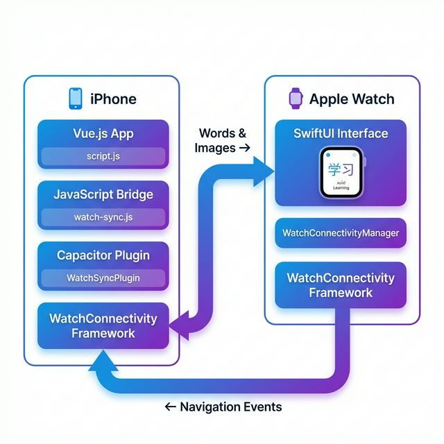

# Apple Watch Companion App Documentation

This directory contains all documentation and resources for the Apple Watch companion app for the Mandarin Learner application.

## 📚 Documentation Files

### Getting Started

- **[WATCH_CHECKLIST.md](WATCH_CHECKLIST.md)** ⭐ **START HERE!**
  - Step-by-step checklist for Xcode setup
  - Testing scenarios and success criteria
  - Troubleshooting guide
  - Estimated time: 30-45 minutes

### Comprehensive Guides

- **[WATCH_IMPLEMENTATION_SUMMARY.md](WATCH_IMPLEMENTATION_SUMMARY.md)**
  - Complete overview of what was created
  - Architecture explanation
  - Feature list and usage instructions
  - Future enhancement ideas

- **[WATCH_SETUP.md](WATCH_SETUP.md)**
  - Detailed setup instructions
  - File-by-file explanation
  - Configuration steps
  - Troubleshooting tips

- **[WATCH_QUICK_START.md](WATCH_QUICK_START.md)**
  - Quick reference guide
  - Data flow diagrams
  - Usage examples
  - Common issues and solutions

### Code Reference

- **[watch-integration-guide.js](watch-integration-guide.js)**
  - JavaScript integration code examples
  - Method descriptions
  - Integration points in Vue.js app

## 🖼️ Images

### Architecture Diagram



Shows the complete data flow between iPhone and Apple Watch, including:

- Vue.js app layer
- JavaScript bridge
- Capacitor plugin
- WatchConnectivity framework
- Bidirectional communication

### Interface Mockup


Realistic mockup of the Apple Watch interface showing:

- Flashcard with image
- Chinese characters and Pinyin
- Navigation buttons
- Progress indicator
- Category badges

## 🚀 Quick Start

1. **Read the checklist:**

   ```bash
   cat docs/WATCH_CHECKLIST.md
   ```

2. **Open Xcode:**

   ```bash
   open ios/App/App.xcodeproj
   ```

3. **Follow the steps** in WATCH_CHECKLIST.md

## 📁 File Structure

```
docs/
├── README.md                           # This file
├── WATCH_CHECKLIST.md                  # Step-by-step setup guide
├── WATCH_IMPLEMENTATION_SUMMARY.md     # Complete overview
├── WATCH_SETUP.md                      # Detailed instructions
├── WATCH_QUICK_START.md                # Quick reference
├── watch-integration-guide.js          # Code examples
└── images/
    ├── watch_app_architecture.png      # Architecture diagram
    └── watch_interface_mockup.png      # UI mockup
```

## 🎯 What You'll Build

An Apple Watch companion app that:

- ✅ Displays flashcards synchronized with iPhone
- ✅ Shows images, Chinese characters, Pinyin, and English
- ✅ Supports bidirectional navigation
- ✅ Allows toggling Pinyin/English visibility
- ✅ Shows progress indicator
- ✅ Works seamlessly with all learning modes

## 💡 Key Features

### Real-time Sync

- iPhone and Watch always show the same flashcard
- Navigation on either device updates both
- Automatic sync when starting sessions

### Beautiful Interface

- Native SwiftUI design
- Follows Apple Watch design guidelines
- Smooth animations and transitions
- Optimized for small screen

### Robust Communication

- Uses Apple's WatchConnectivity framework
- Handles offline scenarios gracefully
- Efficient data transfer with base64 images
- Error handling and recovery

## 🔧 Technical Details

### Technologies Used

- **WatchOS**: SwiftUI for Watch interface
- **iOS**: Swift + Capacitor plugin
- **JavaScript**: Vue.js integration
- **Communication**: WatchConnectivity framework

### Data Flow

1. User starts session on iPhone
2. Vue.js calls `WatchSync.syncWords()`
3. Capacitor plugin sends to iOS
4. WatchConnectivity sends to Watch
5. Watch displays flashcards
6. User navigates on Watch
7. Watch sends index to iPhone
8. iPhone updates and plays audio

## 📖 Additional Resources

- [Apple WatchConnectivity Documentation](https://developer.apple.com/documentation/watchconnectivity)
- [SwiftUI for watchOS](https://developer.apple.com/documentation/swiftui)
- [Capacitor iOS Plugins](https://capacitorjs.com/docs/plugins/ios)

## 🆘 Support

If you encounter issues:

1. Check the troubleshooting section in WATCH_CHECKLIST.md
2. Review console logs for WatchConnectivity errors
3. Verify all files are in correct Xcode targets
4. Clean and rebuild the project

## ✅ Status

- **Code**: ✅ Complete and ready
- **Documentation**: ✅ Comprehensive guides provided
- **Images**: ✅ Architecture and mockups included
- **Next Step**: Follow WATCH_CHECKLIST.md to complete Xcode setup

---

**Ready to build?** Start with [WATCH_CHECKLIST.md](WATCH_CHECKLIST.md)! 🚀
